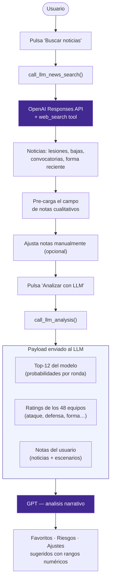

# WCUP 2026 Predictor

> **Autor:** Francisco Gonzalez · [Quality Analytics](https://www.qualityanalytics.com)


Aplicacion Streamlit para simular el Mundial 2026 combinando **simulacion Monte Carlo**, **modelo de goles Poisson** y una capa de **inteligencia artificial** que busca noticias en tiempo real e interpreta los resultados del modelo con lenguaje natural.

---

## Caracteristicas principales

| Modulo | Descripcion |
|---|---|
| **Simulacion Monte Carlo** | Corre el torneo completo N veces (configurable) y acumula probabilidades en cada ronda. |
| **Modelo de goles Poisson** | Convierte ratings de ataque/defensa en goles esperados partido a partido, incluyendo tiempos extra y penales. |
| **LLM — Busqueda de noticias** | Llama a la API de OpenAI con `web_search` activo para obtener noticias recientes de lesiones, bajas, convocatorias y forma de los favoritos. Las noticias se inyectan directamente en el campo de analisis cualitativo. |
| **LLM — Interpretacion de resultados** | Envía el top-12 del modelo junto con los ratings y el escenario del usuario al LLM para obtener un analisis narrativo: favoritos, riesgos cualitativos y ajustes sugeridos con rangos numericos accionables. |
| **Ratings editables** | Elo aproximado, ataque, defensa, plantilla y forma ajustables en UI o CSV. |
| **Visualizaciones interactivas** | Graficos de barras Plotly por ronda, tabla de grupos y bracket de eliminatoria. |

---

## Flujo LLM



La novedad respecto a modelos clasicos es que **el LLM no solo interpreta salidas estadisticas**, sino que tambien **recupera contexto real actualizado** (noticias, convocatorias, sanciones) usando `web_search` de la Responses API, unificando informacion cuantitativa y cualitativa en un solo flujo.

---

## Instalacion y ejecucion

### Requisitos previos

- [Miniconda / Anaconda](https://docs.conda.io/en/latest/miniconda.html)
- Clave de API de OpenAI

### Pasos

```powershell
# 1. Clonar o descomprimir el proyecto
cd WCUP2026

# 2. Crear el entorno conda
conda env create -f environment.yml
conda activate wcup2026

# 3. Crear el archivo de variables de entorno
# Crea un archivo .env en la raiz con el siguiente contenido:
#   OPENAI_API_KEY=tu_clave_aqui
#   OPENAI_MODEL=gpt-5   # opcional; default: gpt-5

# 4. Lanzar la app
streamlit run app.py
```

> La clave nunca se importa en el codigo. La app invoca `load_dotenv()` y el SDK de OpenAI lee `OPENAI_API_KEY` directamente desde el entorno.

---

## Cobertura del torneo

- **48 equipos** distribuidos en **12 grupos** segun el sorteo FIFA 2026.
- Clasifican los **dos primeros de cada grupo** mas los **ocho mejores terceros**.
- **Ronda de 32** construida siguiendo el calendario oficial FIFA.
- Probabilidades calculadas por ronda: Fase de grupos → Ronda de 32 → Octavos → Cuartos → Semifinal → Final → Campeon.

---

## Por que Monte Carlo + Poisson

FiveThirtyEight explica que primero convierte ratings de equipos en probabilidades partido a partido usando goles esperados y distribuciones Poisson; despues transforma esas probabilidades en un pronostico de torneo con simulaciones Monte Carlo. The Alan Turing Institute aplico una idea parecida para 2022: modelo estadistico tipo Dixon-Coles/Bayesiano para estimar marcadores y corrio todo el calendario 100,000 veces para ver que equipos ganaban con mas frecuencia.

La justificacion es practica: un Mundial no depende solo de quien es mejor, sino tambien de grupos, empates, diferencia de goles, mejores terceros, cruces de eliminatoria, penales y ruta al titulo. Monte Carlo permite simular miles de torneos completos y convertir esa incertidumbre en probabilidades faciles de leer. Por eso la app no da un unico ganador fijo; entrega probabilidades ajustables que el usuario puede recalibrar con informacion actual.

---

## Estructura del codigo

```
WCUP2026/
├── app.py                  # Punto de entrada Streamlit
├── environment.yml         # Entorno conda reproducible
├── requirements.txt        # Dependencias pip alternativas
├── data/
│   └── teams_seed.csv      # Ratings base de los 48 equipos
└── wcup2026/
    ├── config.py           # Rutas, URLs, grupos, columnas y colores
    ├── parameters.py       # Parametros del simulador (N simulaciones, etc.)
    ├── data.py             # Lectura, validacion y preparacion de ratings
    ├── bracket.py          # Estructura de ronda de 32 y eliminatorias
    ├── simulator.py        # Poisson, grupos, eliminatorias y Monte Carlo
    ├── llm.py              # Busqueda de noticias e interpretacion con OpenAI
    └── ui.py               # Componentes visuales y flujo de Streamlit
```

---

## Ideas de mejora futuras

- **RAG con scouting**: conectar un vector store con reportes de convocatorias y minutos recientes para contextualizar aun mas el LLM.
- **Escenarios automaticos**: generar hipotesis de localia, clima, penales y bajas clave sin intervencion manual.
- **Alertas de ratings**: detectar equipos con ratings fuera de rango o inconsistencias en el CSV.
- **Reportes narrativos**: generar un mini-analisis por seleccion listo para publicar en newsletter.
- **Actualizacion dinamica de ratings**: ajustar ataque/defensa automaticamente segun resultados reales del torneo.

---

## Fuentes

| Recurso | URL |
|---|---|
| FIFA Final Draw 2026 | https://www.fifa.com/en/tournaments/mens/worldcup/canadamexicousa2026/articles/final-draw-results |
| FIFA Match Schedule | https://www.fifa.com/en/tournaments/mens/worldcup/canadamexicousa2026/articles/match-schedule-fixtures-results-teams-stadiums |
| FiveThirtyEight — metodologia Mundial | https://fivethirtyeight.com/features/how-our-2022-world-cup-predictions-work/ |
| Alan Turing Institute — modelo 2022 | https://www.turing.ac.uk/blog/can-our-algorithm-predict-winner-2022-football-world-cup |
| Opta Analyst — predicciones 2022 | https://theanalyst.com/articles/who-will-win-the-2022-fifa-world-cup-predictions |
| OpenAI Responses API | https://platform.openai.com/docs/api-reference/responses |

---

*Desarrollado por **Francisco Gonzalez** para **Quality Analytics** · 2026*
