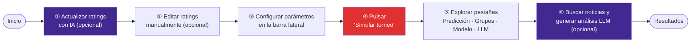
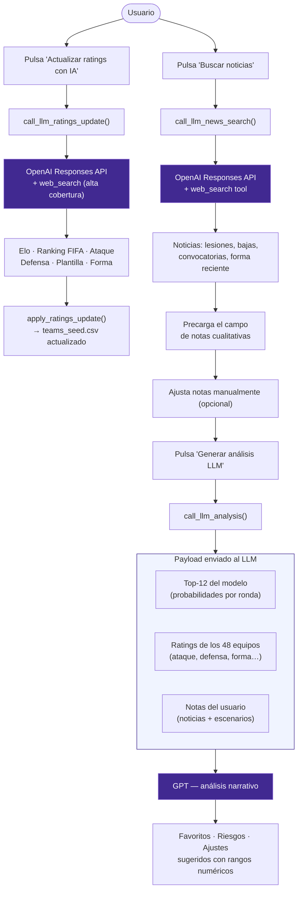
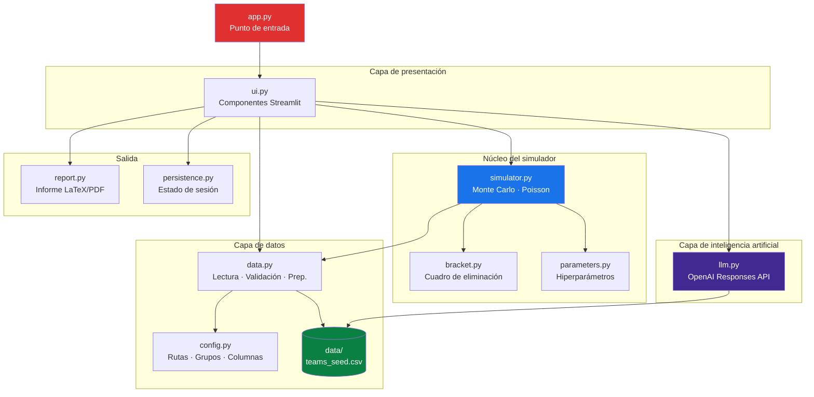
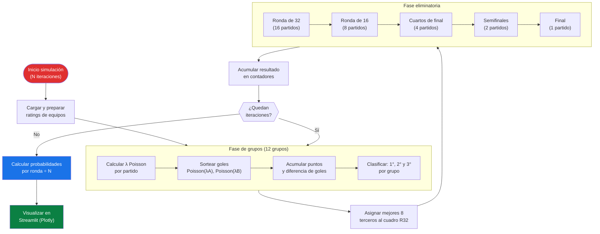
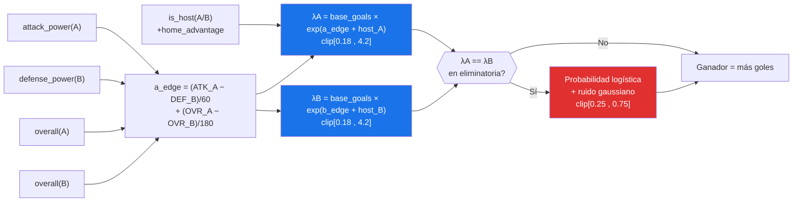
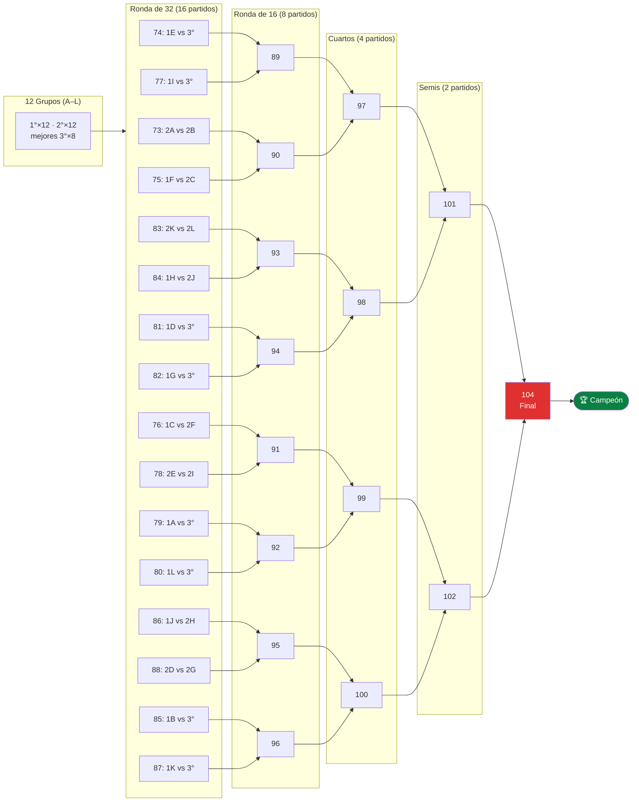

# WCUP 2026 Predictor

> **Autor:** Francisco Gonzalez · [Quality Analytics](https://www.qualityanalytics.com)


Aplicación de Streamlit para simular el Mundial 2026 combinando **simulación Monte Carlo**, **modelo de goles Poisson** y una capa de **inteligencia artificial** que actualiza ratings con búsqueda web, consulta noticias en tiempo real e interpreta los resultados del modelo con lenguaje natural.

---

## Aviso sobre apuestas

Este proyecto es solo para fines informativos, educativos y analíticos. Las probabilidades, simulaciones, rankings, salidas del LLM y archivos exportados no constituyen consejo financiero, recomendación de apuesta ni garantía de resultados. Cualquier decisión relacionada con apuestas deportivas debe tomarse bajo responsabilidad personal, considerando la legislación aplicable, la edad mínima legal y los riesgos de pérdida.

---

## Características principales

| Módulo | Descripción |
|---|---|
| **Simulación Monte Carlo** | Corre el torneo completo N veces (configurable) al pulsar un botón. Acumula probabilidades por ronda sin bloquear la UI. |
| **Modelo de goles Poisson** | Convierte ratings de ataque/defensa en goles esperados partido a partido, incluyendo tiempos extra y penales. |
| **Actualización de ratings con IA** | Un botón llama a la API de OpenAI con `web_search` para obtener Elo, ranking FIFA, ataque, defensa, plantilla y forma actualizados para los 48 equipos. Los valores se fusionan en el dataset base y se guardan en `data/teams_seed.csv`. |
| **LLM — Búsqueda de noticias** | Llama a la API de OpenAI con `web_search` activo para obtener noticias recientes de lesiones, bajas, convocatorias y forma de los favoritos. Las noticias se inyectan directamente en el campo de análisis cualitativo. |
| **LLM — Interpretación de resultados** | Envía el top-12 del modelo junto con los ratings y el escenario del usuario al LLM para obtener un análisis narrativo: favoritos, riesgos cualitativos y ajustes sugeridos con rangos numéricos accionables. |
| **Ratings editables** | Elo aproximado, ataque, defensa, plantilla y forma ajustables directamente en la tabla interactiva de la UI. |
| **Visualizaciones interactivas** | Gráficos de barras de Plotly por ronda, tabla de grupos y comparador de duelos directos. |
| **Exportación CSV** | Botón de descarga que genera un CSV con los resultados de la simulación, listo para subir a la [Quiniela de Modelos Predictivos WCUP 2026](https://www.kaggle.com/competitions/quiniela-de-modelos-predictivos-wcup-2026) en Kaggle. |

---

## Flujo de uso



---

## Flujo LLM



La novedad frente a modelos clásicos es que **el LLM no solo interpreta salidas estadísticas**, sino que también **recupera y actualiza datos reales** (ratings, noticias, convocatorias y sanciones) usando `web_search` de la Responses API, unificando información cuantitativa y cualitativa en un solo flujo.

---

## Arquitectura de módulos



---

## Flujo de simulación Monte Carlo



---

## Cálculo de goles esperados (Poisson)



---

## Estructura del cuadro eliminatorio FIFA 2026



---

## Instalación y ejecución

### Requisitos previos

- [Miniconda / Anaconda](https://docs.conda.io/en/latest/miniconda.html)
- Clave de API de OpenAI

### Pasos

```powershell
# 1. Clonar o descomprimir el proyecto
cd WCUP2026

# 2. Crear el entorno conda
conda env create -f environment.yml
conda activate wcup2026

# 3. Crear el archivo de variables de entorno
# Crea un archivo .env en la raíz con el siguiente contenido:
#   OPENAI_API_KEY=tu_clave_aqui
#   OPENAI_MODEL=gpt-5   # opcional; default: gpt-5.5

# 4. Lanzar la app
streamlit run app.py
```

> La clave nunca se importa en el código. La app invoca `load_dotenv()` y el SDK de OpenAI lee `OPENAI_API_KEY` directamente desde el entorno.

---

## Cobertura del torneo

- **48 equipos** distribuidos en **12 grupos** según el sorteo FIFA 2026.
- Clasifican los **dos primeros de cada grupo** más los **ocho mejores terceros**.
- **Ronda de 32** construida siguiendo el calendario oficial FIFA.
- Probabilidades calculadas por ronda: Fase de grupos → Ronda de 32 → Octavos → Cuartos → Semifinal → Final → Campeón.

---

## Por qué Monte Carlo + Poisson

FiveThirtyEight explica que primero convierte ratings de equipos en probabilidades partido a partido usando goles esperados y distribuciones de Poisson; después transforma esas probabilidades en un pronóstico de torneo con simulaciones Monte Carlo. The Alan Turing Institute aplicó una idea parecida para 2022: un modelo estadístico tipo Dixon-Coles/Bayesiano para estimar marcadores y correr todo el calendario 100,000 veces, con el fin de ver qué equipos ganaban con más frecuencia.

La justificación es práctica: un Mundial no depende solo de quién es mejor, sino también de grupos, empates, diferencia de goles, mejores terceros, cruces de eliminatoria, penales y ruta al título. Monte Carlo permite simular miles de torneos completos y convertir esa incertidumbre en probabilidades fáciles de leer. Por eso la app no da un único ganador fijo; entrega probabilidades ajustables que el usuario puede recalibrar con información actual.

---

## Estructura del código

```
WCUP2026/
├── app.py                  # Punto de entrada Streamlit
├── environment.yml         # Entorno conda reproducible
├── requirements.txt        # Dependencias pip alternativas
├── data/
│   └── teams_seed.csv      # Ratings base de los 48 equipos (actualizable con IA)
└── wcup2026/
    ├── config.py           # Rutas, URLs, grupos, columnas y colores
    ├── parameters.py       # Parámetros del simulador (N simulaciones, etc.)
    ├── data.py             # Lectura, validación, preparación y fusión de ratings
    ├── bracket.py          # Estructura de ronda de 32 y eliminatorias
    ├── simulator.py        # Poisson, grupos, eliminatorias y Monte Carlo
    ├── llm.py              # Actualización de ratings, noticias e interpretación con OpenAI
    └── ui.py               # Componentes visuales y flujo de Streamlit
```

---

## Ideas de mejora futuras

- **RAG con scouting**: conectar un vector store con reportes de convocatorias y minutos recientes para contextualizar aún más el LLM.
- **Escenarios automáticos**: generar hipótesis de localía, clima, penales y bajas clave sin intervención manual.
- **Alertas de ratings**: detectar equipos con ratings fuera de rango o inconsistencias en el CSV.
- **Reportes narrativos**: generar un mini análisis por selección listo para publicar en newsletter.

---

## Fuentes

| Recurso | URL |
|---|---|
| FIFA Final Draw 2026 | https://www.fifa.com/en/tournaments/mens/worldcup/canadamexicousa2026/articles/final-draw-results |
| FIFA Match Schedule | https://www.fifa.com/en/tournaments/mens/worldcup/canadamexicousa2026/articles/match-schedule-fixtures-results-teams-stadiums |
| FiveThirtyEight — metodologia Mundial | https://fivethirtyeight.com/features/how-our-2022-world-cup-predictions-work/ |
| Alan Turing Institute — modelo 2022 | https://www.turing.ac.uk/blog/can-our-algorithm-predict-winner-2022-football-world-cup |
| Opta Analyst — predicciones 2022 | https://theanalyst.com/articles/who-will-win-the-2022-fifa-world-cup-predictions |
| OpenAI Responses API | https://platform.openai.com/docs/api-reference/responses |
| Quiniela de Modelos Predictivos WCUP 2026 (Kaggle) | https://www.kaggle.com/competitions/quiniela-de-modelos-predictivos-wcup-2026 |

---

*Desarrollado por **Francisco Gonzalez** para **Quality Analytics** · 2026*
