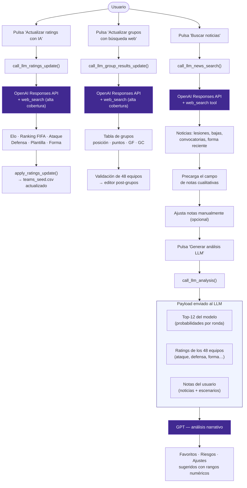
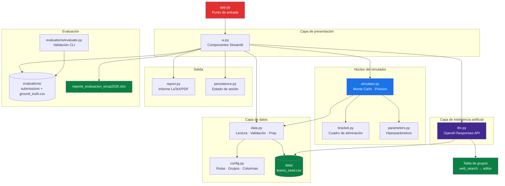
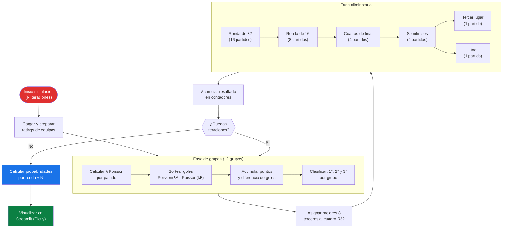
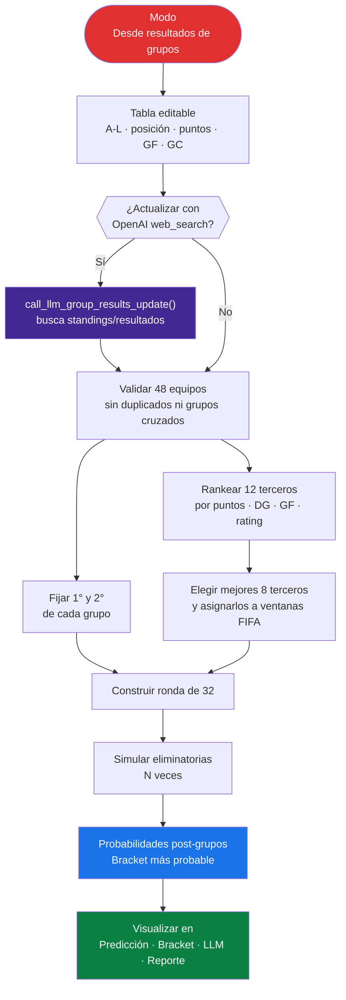
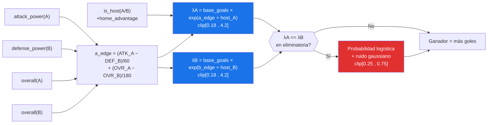
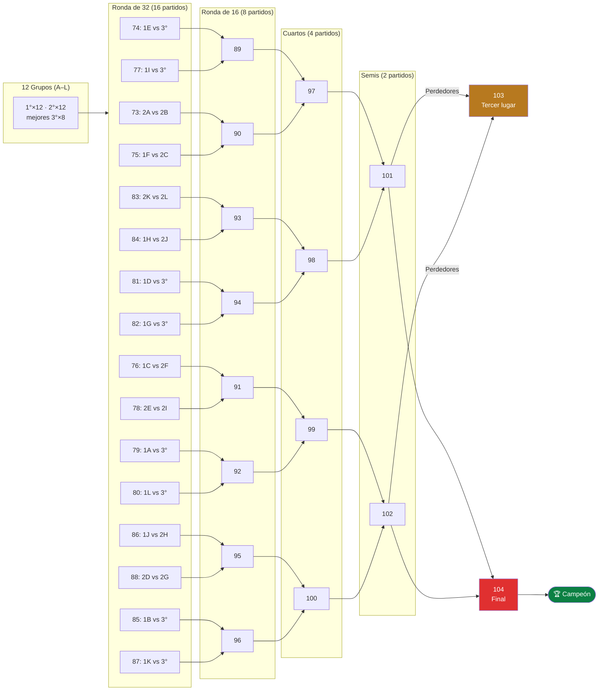

# WCUP 2026 Predictor

> **Autor:** Francisco Gonzalez · [Quality Analytics](https://www.qualityanalytics.com)


Aplicación de Streamlit para simular el Mundial 2026 combinando **simulación Monte Carlo**, **modelo de goles Poisson** y una capa de **inteligencia artificial** que actualiza ratings con búsqueda web, consulta resultados de grupos en tiempo real, revisa noticias e interpreta los resultados del modelo con lenguaje natural.

---

## Aviso sobre apuestas

Este proyecto es solo para fines informativos, educativos y analíticos. Las probabilidades, simulaciones, rankings, salidas del LLM y archivos exportados no constituyen consejo financiero, recomendación de apuesta ni garantía de resultados. Cualquier decisión relacionada con apuestas deportivas debe tomarse bajo responsabilidad personal, considerando la legislación aplicable, la edad mínima legal y los riesgos de pérdida.

---

## Características principales

| Módulo | Descripción |
|---|---|
| **Simulación Monte Carlo** | Corre el torneo completo N veces (configurable) al pulsar un botón. Acumula probabilidades por ronda sin bloquear la UI. |
| **Alcance de simulación** | Permite elegir entre simular el torneo completo o fijar los resultados de fase de grupos y modelar solo las eliminatorias. |
| **Llaves desde grupos reales** | Carga manualmente la tabla final de grupos (`posición`, puntos, GF, GC) o actualízala con OpenAI `web_search`; la app arma la ronda de 32 FIFA, asigna mejores terceros y estima probabilidades post-grupos. |
| **Modelo de goles Poisson** | Convierte ratings de ataque/defensa en goles esperados partido a partido, incluyendo tiempos extra y penales. |
| **Actualización de ratings con IA** | Un botón llama a la API de OpenAI con `web_search` para obtener Elo, ranking FIFA, ataque, defensa, plantilla y forma actualizados para los 48 equipos. Los valores se fusionan en el dataset base y se guardan en `data/teams_seed.csv`. |
| **Actualización de grupos con IA** | En modo post-grupos, un botón llama a OpenAI con `web_search` para buscar standings/resultados recientes y llenar la tabla de grupos validando los 48 equipos esperados. |
| **LLM — Búsqueda de noticias** | Llama a la API de OpenAI con `web_search` activo para obtener noticias recientes de lesiones, bajas, convocatorias y forma de los favoritos. Las noticias se inyectan directamente en el campo de análisis cualitativo. |
| **LLM — Interpretación de resultados** | Envía el top-12 del modelo junto con los ratings y el escenario del usuario al LLM para obtener un análisis narrativo: favoritos, riesgos cualitativos y ajustes sugeridos con rangos numéricos accionables. |
| **Ratings editables** | Elo aproximado, ataque, defensa, plantilla y forma ajustables directamente en la tabla interactiva de la UI. |
| **Visualizaciones interactivas** | Gráficos de barras de Plotly por ronda, tabla de grupos y comparador de duelos directos. |
| **Exportación CSV** | Botón de descarga que genera un CSV con los resultados de la simulación, listo para subir a la [Quiniela de Modelos Predictivos WCUP 2026](https://www.kaggle.com/competitions/quiniela-de-modelos-predictivos-wcup-2026) en Kaggle. |
| **Evaluación manual de submissions** | La pestaña **Evaluar** valida los CSVs de `evaluations/` solo cuando el usuario pulsa **Evaluar submissions**. Si existe `ground_truth.csv`, calcula Brier Scores por etapa y ranking final. |
| **Reporte Excel de evaluación** | Botones para **Generar reporte Excel** y **Descargar reporte** con hojas de resumen, validación, ranking y gráfico de Score Final. |

---

## Flujo de uso

```mermaid
flowchart LR
    A([Inicio]) --> B["① Actualizar ratings\ncon IA (opcional)"]
    B --> C["② Editar ratings\nmanualmente (opcional)"]
    C --> D["③ Configurar parámetros\nen la barra lateral"]
    D --> S{"④ Alcance de\nsimulación"}
    S --> E1["Torneo completo\nfase de grupos + llaves"]
    S --> E2["Desde resultados\nde grupos"]
    E1 --> F1["Pulsar\n'Simular torneo completo'"]
    E2 --> G1["Cargar tabla de grupos\no actualizar con web_search"]
    G1 --> G2["Pulsar\n'Modelar llaves con estos grupos'"]
    F1 --> H["Explorar pestañas\nPredicción · Bracket · Grupos · Modelo · LLM · Reporte"]
    G2 --> H
    H --> I["Buscar noticias y\ngenerar análisis LLM (opcional)"]
    I --> J["Evaluar submissions\ny generar Excel (opcional)"]
    J --> K([Resultados])

    style B fill:#412991,color:#fff
    style F1 fill:#e03030,color:#fff
    style G2 fill:#e03030,color:#fff
    style I fill:#412991,color:#fff
    style J fill:#0b8043,color:#fff
```



---

## Flujo LLM



La novedad frente a modelos clásicos es que **el LLM no solo interpreta salidas estadísticas**, sino que también **recupera y actualiza datos reales** (ratings, standings de grupos, noticias, convocatorias y sanciones) usando `web_search` de la Responses API, unificando información cuantitativa y cualitativa en un solo flujo.

---

## Modos de simulación

La app tiene un selector **Alcance de simulación** con dos caminos:

| Modo | Qué hace | Cuándo usarlo |
|---|---|---|
| **Torneo completo** | Simula fase de grupos, mejores terceros, ronda de 32 y todas las eliminatorias en cada iteración Monte Carlo. | Antes o durante el torneo, cuando quieres un pronóstico integral desde cero. |
| **Desde resultados de grupos** | Fija la tabla de cada grupo, asigna clasificados y mejores terceros, y simula solo las llaves. | Cuando ya tienes resultados reales/parciales de fase de grupos o quieres evaluar escenarios específicos de clasificación. |

En **Desde resultados de grupos**, la tabla editable requiere:

```csv
group,position,team,points,gf,ga
A,1,Mexico,7,5,2
A,2,Korea Republic,5,4,3
A,3,Czechia,4,3,3
A,4,South Africa,0,1,5
```

El botón **Actualizar grupos con búsqueda web** usa OpenAI `web_search` para buscar la tabla actual/final, normaliza nombres de equipos, valida que existan los 48 participantes y reemplaza el editor. Si la fase de grupos todavía no ha terminado, usa la tabla más reciente disponible; si ya terminó, usa la tabla final.

---

## Evaluación de submissions

La pestaña **Evaluar** permite revisar archivos de predicción sin que la app lo haga automáticamente al cargar la vista. El usuario controla el flujo con tres botones:

1. **Evaluar submissions**: busca CSVs en `evaluations/`, valida formato, equipos, duplicados y probabilidades en rango `[0, 1]`.
2. **Generar reporte Excel**: crea un archivo XLSX en memoria con resumen, validación, ranking y gráfico.
3. **Descargar reporte**: descarga `reporte_evaluacion_wcup2026.xlsx` cuando el reporte ya fue generado.

Los archivos de submission deben tener esta estructura:

```csv
team,prob_champion,prob_final,prob_semifinal
Argentina,0.1650,0.2810,0.4320
France,0.1420,0.2510,0.4010
```

Para calcular scores reales, coloca `ground_truth.csv` dentro de `evaluations/` con:

```csv
team,champion,final,semifinal
Argentina,1,1,1
France,0,1,1
```

El score principal es un Brier Score ponderado:

| Etapa | Peso |
|---|---:|
| Campeón (`prob_champion`) | 50% |
| Final (`prob_final`) | 30% |
| Semifinal (`prob_semifinal`) | 20% |

Menor score significa mejor calibración contra el resultado real.

---

## Arquitectura de módulos



---

## Flujo de simulación Monte Carlo



---

## Flujo post-grupos



---

## Cálculo de goles esperados (Poisson)



---

## Estructura del cuadro eliminatorio FIFA 2026



---

## Instalación y ejecución

### Requisitos previos

- [Miniconda / Anaconda](https://docs.conda.io/en/latest/miniconda.html)
- Clave de API de OpenAI

### Pasos

```powershell
# 1. Clonar o descomprimir el proyecto
cd WCUP2026

# 2. Crear el entorno conda
conda env create -f environment.yml
conda activate wcup2026

# 3. Crear el archivo de variables de entorno
# Crea un archivo .env en la raíz con el siguiente contenido:
#   OPENAI_API_KEY=tu_clave_aqui
# Todas las acciones de IA usan gpt-5.6-luna (fijado en la aplicacion).

# 4. Lanzar la app
streamlit run app.py
```

> La clave nunca se importa en el código. La app invoca `load_dotenv()` y el SDK de OpenAI lee `OPENAI_API_KEY` directamente desde el entorno.

---

## Cobertura del torneo

- **48 equipos** distribuidos en **12 grupos** según el sorteo FIFA 2026.
- Clasifican los **dos primeros de cada grupo** más los **ocho mejores terceros**.
- **Ronda de 32** construida siguiendo el calendario oficial FIFA.
- Probabilidades calculadas por ronda: Fase de grupos → Ronda de 32 → Octavos → Cuartos → Semifinal → Final → Campeón, más la probabilidad específica de ganar el partido por el tercer lugar.
- En modo **Desde resultados de grupos**, la fase de grupos se trata como observada/fija y las probabilidades se recalculan solo para Ronda de 32 → Octavos → Cuartos → Semifinal → Final → Campeón.

---

## Por qué Monte Carlo + Poisson

FiveThirtyEight explica que primero convierte ratings de equipos en probabilidades partido a partido usando goles esperados y distribuciones de Poisson; después transforma esas probabilidades en un pronóstico de torneo con simulaciones Monte Carlo. The Alan Turing Institute aplicó una idea parecida para 2022: un modelo estadístico tipo Dixon-Coles/Bayesiano para estimar marcadores y correr todo el calendario 100,000 veces, con el fin de ver qué equipos ganaban con más frecuencia.

La justificación es práctica: un Mundial no depende solo de quién es mejor, sino también de grupos, empates, diferencia de goles, mejores terceros, cruces de eliminatoria, penales y ruta al título. Monte Carlo permite simular miles de torneos completos y convertir esa incertidumbre en probabilidades fáciles de leer. Por eso la app no da un único ganador fijo; entrega probabilidades ajustables que el usuario puede recalibrar con información actual.

---

## Estructura del código

```
WCUP2026/
├── app.py                  # Punto de entrada Streamlit
├── environment.yml         # Entorno conda reproducible
├── requirements.txt        # Dependencias pip alternativas
├── data/
│   └── teams_seed.csv      # Ratings base de los 48 equipos (actualizable con IA)
├── evaluations/
│   ├── evaluate.py         # Validador/evaluador CLI de submissions
│   ├── ground_truth.csv    # Resultados reales para calcular Brier Scores
│   └── *.csv               # Submissions a evaluar desde la pestaña Evaluar
├── reporte/
│   └── ...                 # Archivos LaTeX/PDF generados
├── resultados/
│   └── ...                 # Persistencia de simulaciones y análisis
└── wcup2026/
    ├── config.py           # Rutas, URLs, grupos, columnas y colores
    ├── parameters.py       # Parámetros del simulador (N simulaciones, etc.)
    ├── data.py             # Lectura, validación, preparación y fusión de ratings
    ├── bracket.py          # Estructura de ronda de 32 y eliminatorias
    ├── simulator.py        # Poisson, grupos, eliminatorias, post-grupos y Monte Carlo
    ├── llm.py              # Actualización de ratings, grupos, noticias e interpretación con OpenAI
    ├── persistence.py      # Persistencia de resultados y estado recuperable
    ├── report.py           # Reporte LaTeX/PDF de simulación
    └── ui.py               # Componentes visuales y flujo de Streamlit
```

---

## Ideas de mejora futuras

- **RAG con scouting**: conectar un vector store con reportes de convocatorias y minutos recientes para contextualizar aún más el LLM.
- **Escenarios automáticos**: generar hipótesis de localía, clima, penales y bajas clave sin intervención manual.
- **Alertas de ratings**: detectar equipos con ratings fuera de rango o inconsistencias en el CSV.
- **Reportes narrativos**: generar un mini análisis por selección listo para publicar en newsletter.

---

## Licencia

Este proyecto se distribuye bajo la licencia **Creative Commons Attribution 4.0 International (CC BY 4.0)**. Puedes compartir y adaptar el material, incluso con fines comerciales, siempre que otorgues la atribución correspondiente.

Consulta el texto completo en [LICENSE](LICENSE) o en <https://creativecommons.org/licenses/by/4.0/>.

---

## Fuentes

| Recurso | URL |
|---|---|
| FIFA Final Draw 2026 | https://www.fifa.com/en/tournaments/mens/worldcup/canadamexicousa2026/articles/final-draw-results |
| FIFA Match Schedule | https://www.fifa.com/en/tournaments/mens/worldcup/canadamexicousa2026/articles/match-schedule-fixtures-results-teams-stadiums |
| FiveThirtyEight — metodologia Mundial | https://fivethirtyeight.com/features/how-our-2022-world-cup-predictions-work/ |
| Alan Turing Institute — modelo 2022 | https://www.turing.ac.uk/blog/can-our-algorithm-predict-winner-2022-football-world-cup |
| Opta Analyst — predicciones 2022 | https://theanalyst.com/articles/who-will-win-the-2022-fifa-world-cup-predictions |
| OpenAI Responses API | https://platform.openai.com/docs/api-reference/responses |
| Quiniela de Modelos Predictivos WCUP 2026 (Kaggle) | https://www.kaggle.com/competitions/quiniela-de-modelos-predictivos-wcup-2026 |

---

*Desarrollado por **Francisco Gonzalez** para **Quality Analytics** · 2026*
